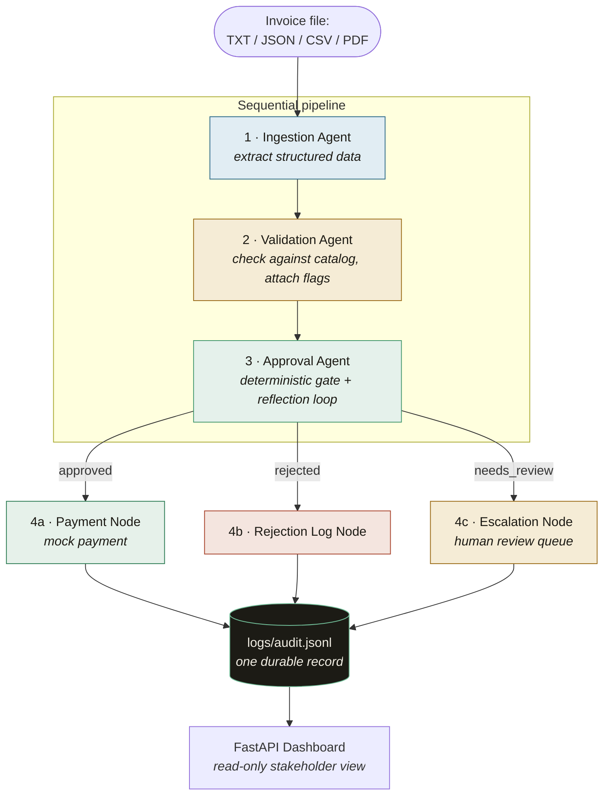
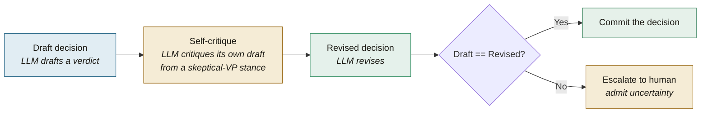

# Invoice Processing Automation

An agentic, multi-stage pipeline that ingests raw invoices, validates them against an inventory/vendor catalog, makes a defensible approval decision, and either pays, rejects, or escalates them, leaving an audit trail behind every decision. Built as a case study for replacing a manual AP (accounts payable) email-approval chain.

The system reads invoices in **four formats** (TXT, JSON, CSV, PDF), reasons about them with a mix of deterministic rules and LLM judgment, and never silently auto-pays anything it isn't confident about, when it's uncertain, it escalates to a human.

---

## Table of Contents

- [Case Study](#case-study)
- [Key ideas](#key-ideas)
- [Workflow](#workflow)
- [The four agents in detail](#the-four-agents-in-detail)
- [Project structure](#project-structure)
- [Getting started](#getting-started)
- [Usage](#usage)
- [The dashboard](#the-dashboard)
- [Configuration](#configuration)
- [The audit trail](#the-audit-trail)
- [Testing](#testing)
- [Design principles](#design-principles)

---

## Case Study

Acme Corp is a PE-backed manufacturing firm losing $2M/year on manual invoice processing. Invoices arrive via email as PDFs in messy formats with frequent errors. Staff manually extract data, validate against a legacy inventory database (inconsistent), obtain VP approval (via email chains), and process payment (via a banking API).

This project automates that chain while keeping a human in the loop *only where judgment is genuinely needed*. Clean, low-value invoices from trusted vendors are approved automatically in milliseconds. Ambiguous or high-value ones get a careful, self-critiquing LLM review. Anything the system can't confidently resolve is escalated rather than guessed at.

---

## Key ideas

A few principles run through the whole codebase and are worth internalizing before you read the code:

**Flag, don't reject.** The validation stage *never* hard-fails an invoice. It attaches typed flags (e.g. `UNKNOWN_ITEM`, `STOCK_EXCEEDED`) and hands them downstream. The approval agent is the only stage that renders a verdict.

**Fail-forward, never crash.** Every node in the pipeline takes state in and returns state out — it *never raises into the graph*. A failed extraction, an unreachable LLM, or a disk write error routes the invoice to a safe terminal state (usually human review) rather than sinking the run. One bad invoice never takes down a batch.

**Policy is code, not LLM judgment.** Hard rules (any error-severity flag or an amount over $10K -> full review) are enforced deterministically *before* a token is ever spent. A hallucinating model can't override them.

**Admit uncertainty.** The approval agent can return a third outcome beyond approve/reject: `needs_review`. When the system is genuinely unsure, it escalates to a human instead of forcing a coin-flip.

---

## Workflow

Every invoice flows through four sequential agents and then fans out to one of three terminal nodes based on the approval decision. Each terminal node writes exactly one audit record.



The orchestration is a [LangGraph](https://github.com/langchain-ai/langgraph) state machine. The graph is linear through approval, then a **conditional edge** routes on the approval decision to one of three terminal nodes. All four stages read from and write to a single shared `InvoiceState` object.

### The shared state contract (models/state.py.InvoiceState)

Every agent reads from and writes to one `InvoiceState` (a `TypedDict` defined in `models/state.py`). As the invoice moves through the pipeline, the state accumulates: raw content -> structured `invoice_data` -> `validation_result` -> `approval_result` -> final audit record. The `processing_stage` field tracks progress:

```
pending -> extracted -> validated -> (approved | rejected | needs_review)
```

---

## The four agents in detail

### 1 · Ingestion Agent (`agents/ingestion.py`)

Turns a raw invoice file into a structured, confidence-scored `InvoiceData` object using a **two-pass design**:

- **Pass 1 — deterministic (fast, zero-cost):** format-specific extractors — `pdfplumber`/`PyMuPDF` for PDF, compiled regexes for TXT, `pandas` for CSV, and `json` for JSON. Clean matches earn `HIGH` confidence; fuzzy fallbacks earn `MEDIUM`.
- **Pass 2 — LLM (only when needed):** if Pass 1 leaves a required field missing or low-confidence, the raw text is handed to an LLM. A **self-correcting retry loop** re-prompts the model on a validation failure (up to 3 attempts). LLM results are *merged* into the Pass-1 results, so a `HIGH`-confidence deterministic field is never overwritten by a model that might hallucinate.

A clean invoice never pays an "LLM tax", it's extracted entirely by Pass 1. If Pass 2 exhausts its retries, ingestion raises a `ValueError` carrying every failed attempt, and the graph routes the invoice to human review.

### 2 · Validation Agent (`agents/validation.py`)

Checks the extracted data against `inventory.db` and emits a typed `ValidationResult`. Its philosophy is *flag, don't reject*: even a heavily-flagged invoice produces a clean result object for the approval agent to reason over.

| Flag code | Scope | Severity | Meaning |
|---|---|---|---|
| `UNKNOWN_ITEM` | item | error | Item not in the inventory catalog |
| `STOCK_EXCEEDED` | item | error | Requested quantity exceeds available stock |
| `ZERO_STOCK` | item | error | Item exists but has zero stock |
| `NEGATIVE_QUANTITY` | item | error | Line-item quantity is negative |
| `VENDOR_UNRECOGNIZED` | invoice | warning | Vendor is not on the approved-vendor list |
| `ZERO_AMOUNT` | invoice | warning | Invoice total is zero or negative |
| `LOW_CONFIDENCE_EXTRACTION` | invoice | warning | A required field was extracted with low trust |

The flag taxonomy and its severities are a **fixed contract**. The approval agent routes on flag severity, so these are typed enums, not free strings.

### 3 · Approval Agent (`agents/approval.py`)

The most agentic part of the pipeline, with two layers:

**A deterministic gate** applies hard policy rules *before* spending a token, in priority order:

1. Any error-severity flag → **full critique loop**.
2. Amount over `$10,000` → **full critique loop**.
3. Clean, under `$1,000`, high-confidence → **fast-track approve** (no LLM).
4. Everything else (warning-only, mid-range amounts) → **full critique loop**.

An unrecognized vendor is only a warning, so it carries a flag (never fast-tracks) and falls through to the critique loop, where the LLM judges the invoice's legitimacy — a legitimate invoice from an unknown vendor can be approved; a suspect one still escalates or is rejected.

**A reflection loop** runs only for the genuinely ambiguous invoices the gate routes to `FULL_LOOP`:



If the draft and the revision agree, that decision is committed. If they disagree, the invoice escalates to a human. If the LLM is unreachable, the result escalates to `needs_review`, never a crash, and never a silent auto-approve. The full draft -> critique -> revise transcript is captured for the audit log.

> **Reconciliation gaps escalate to human review.** Validation checks items against inventory but does not assert that the line items add up to the stated total. When a gap exists — because tax, shipping, surcharges, or discounts are on the invoice but not reflected in the extracted line items — the critique loop sees an unexplained difference between the parts and the whole and routes the invoice to `needs_review` rather than approving it. Such an invoice can pass validation with zero flags and still land in the review queue; an unreconciled total is treated as ambiguity for a human to resolve, not something to pay silently.

### 4 · Payment / Terminal Nodes (`agents/payment.py`)

Three terminal nodes, one per approval outcome, each writing exactly one audit record:

- **`payment_node`** (approved) → calls `mock_payment`, records the result with a `payment_status`.
- **`log_node`** (rejected, or a dead upstream invoice) → records the rejection and its reasoning.
- **`escalation_node`** (needs_review) → records the invoice plus its reflection transcript for the human-review queue.

The audit write is *swallow-but-signal*: an I/O error never crashes a payment that already succeeded, it's logged into `processing_log` so an operator can see the durable record didn't land.

---

## Project structure

```
invoice-processing-automation/
│
├── main.py                  # CLI entry point — single-invoice & batch modes
├── setup_db.py              # One-shot seeder for inventory.db (run this first)
├── requirements.txt
├── .env.example             # Copy to .env and add your API key
│
├── agents/                  # The four pipeline stages
│   ├── ingestion.py         #   1 · extract structured data (2-pass)
│   ├── validation.py        #   2 · check against catalog, attach flags
│   ├── approval.py          #   3 · deterministic gate + reflection loop
│   └── payment.py           #   4 · payment / rejection-log / escalation nodes
│
├── graph/
│   └── workflow.py          # LangGraph state machine: nodes, edges, routing
│
├── models/                  # Pydantic / TypedDict data contracts
│   ├── state.py             #   InvoiceState: the shared state object
│   ├── invoice_data.py      #   InvoiceData, LineItem, Confidence
│   └── results.py           #   ValidationResult, ApprovalResult, AuditRecord, flags
│
├── tools/                   # Side-effect boundaries (isolated, swappable)
│   ├── llm.py               #   the only module that talks to a provider API
│   ├── db.py                #   SQLite read helpers + schema
│   ├── audit.py             #   the one place that appends to audit.jsonl
│   └── payment_api.py       #   mock payment gateway
│
├── dashboard/               # FastAPI read-only stakeholder view
│   ├── app.py               #   server: serves the page + /api/summary endpoint
│   ├── audit_source.py      #   reads audit.jsonl -> dashboard payload
│   ├── templates/index.html
│   └── static/              #   styles.css + app.js (no framework)
│
├── data/
│   └── invoices/            # Sample invoices in all four formats
│
├── logs/
│   └── audit.jsonl          # The durable audit trail (created on first run)
│
└── tests/                   # pytest suites, all LLM calls mocked, no live I/O
    ├── test_ingestion.py
    ├── test_validation.py
    ├── test_approval.py
    └── test_payment.py
```

---

## Getting started

### Prerequisites

- Python 3.10+ (the code uses `match` statements and modern type syntax)
- An LLM API key — **xAI Grok** (primary) or **Anthropic Claude** (fallback)

### Installation

```bash
# 1 · Clone and enter the repo
git clone https://github.com/msenzanje/invoice-processing-automation.git
cd invoice-processing-automation

# 2 · (Recommended) create a virtual environment
python -m venv .venv
source .venv/bin/activate          # Windows: .venv\Scripts\activate

# 3 · Install dependencies
pip install -r requirements.txt

# 4 · Configure your API key
cp .env.example .env
#    then edit .env and set XAI_API_KEY=...

# 5 · Seed the inventory / vendor database
python setup_db.py
```

`setup_db.py` creates `inventory.db` with a small catalog and a list of approved vendors. It's idempotent — safe to re-run. It also prints the seeded contents so you can see exactly what invoices are being validated against.

---

## Usage

### Process a single invoice

```bash
python main.py --invoice_path=data/invoices/invoice_1001.txt
```

This prints a rich terminal report: the extracted fields with per-field confidence, the validation flags, and the approval decision (including the full reflection transcript when the critique loop ran). It also tells you where the audit record landed.

Add `--verbose` for DEBUG-level logging:

```bash
python main.py --invoice_path=data/invoices/invoice_1001.txt --verbose
```

### Process a whole directory (batch mode)

```bash
python main.py --batch --invoice_dir=data/invoices/
```

Batch mode processes every invoice file in the directory sequentially, shows a live progress bar, and prints a summary (how many were paid / rejected / sent to review, plus timing). A crash on one invoice never sinks the rest of the batch.

> **Note:** you must provide *exactly one* of `--invoice_path` or `--batch`.

---

## The dashboard

A read-only FastAPI web view over the audit trail — the replacement for the old VP email-approval chain. It never touches the graph or the agents; it just reads `logs/audit.jsonl`.

```bash
uvicorn dashboard.app:app --reload
```
or 
```bash
python -m dashboard
```

Then open <http://127.0.0.1:8000>. The page shows:

- **Executive summary KPIs** — invoices processed, auto-approval rate, average processing time, total value approved.
- **A searchable, filterable table** of every processed invoice, each row expandable to show the reasoning, critique, and flags.
- **A live-processing feed** — the page polls `/api/summary` every few seconds and animates new records in as the pipeline appends them. Run the pipeline in one terminal and watch invoices appear in the browser.
- A **light/dark theme toggle.**

There's also a `/api/health` liveness probe.

---

## Configuration

All configuration is environment-driven via `.env` (see `.env.example`):

| Variable | Default | Purpose |
|---|---|---|
| `XAI_API_KEY` | — | xAI Grok key (primary provider) |
| `ANTHROPIC_API_KEY` | — | Anthropic Claude key (fallback) |
| `LLM_PROVIDER` | auto | Force `grok` or `claude`; auto-detects from whichever key is set |
| `XAI_MODEL` | `grok-3` | Grok model name |
| `LLM_TIMEOUT` | `60` | LLM request timeout (seconds) |
| `APPROVAL_THRESHOLD_HIGH` | `10000` | Amount above which the full critique loop always runs |
| `APPROVAL_THRESHOLD_LOW` | `1000` | Amount below which clean invoices fast-track |
| `LOG_LEVEL` | `INFO` | Logging level |

**Provider selection:** Grok is primary; the system falls back to Claude only if no xAI key is present. Swapping providers is a one-line change in `tools/llm.py` — agents call `get_llm_client().complete(prompt)` and have no idea which provider is behind it.

**Changing approval policy** is a one-line env override — no code change needed.

---

## The audit trail

Every invoice leaves exactly one record in `logs/audit.jsonl` (one JSON object per line, append-only). This is the 
artifact that replaces the email approval chain. Each record carries:

```jsonc
{
  "invoice_id": "invoice_1001",
  "timestamp": "2026-01-15T10:30:00+00:00",  // processing START time
  "vendor": "Widgets Inc.",
  "amount": 5000.0,
  "decision": "approved",                     // approved | rejected | needs_review
  "reasoning": "Fast-tracked: clean validation ...",
  "critique": null,                           // set only if the reflection loop ran
  "flags": [],                                // validation flag codes raised
  "payment_status": "success",                // set only on the approved path
  "processing_time_ms": 142
}
```

`timestamp` plus `processing_time_ms` reconstructs the full processing window. The file is only ever *appended* — never truncated — so the trail is tamper-evident by construction.

---

## Testing

The test suites cover all four agents. Every LLM call is mocked (`MockLLMClient`, zero live API calls), and the database/audit tests run against temporary files, so nothing touches the real `inventory.db` or audit log.

```bash
# Run everything
pytest

# Run one suite
pytest tests/test_approval.py

# Verbose
pytest -v
```

What's covered: deterministic extraction across all four formats, the Pass-1→Pass-2 confidence gate, the self-correction retry loop, every validation check, the approval gate's four routes, the reflection loop (agree→commit, disagree→escalate), all three terminal nodes, and the fail-forward guards throughout.

---

## Design principles

A summary of the architectural choices

- **Pure node functions.** Every graph node is `state in -> state out` and never raises. Side effects (DB reads, LLM calls, disk writes, payments) live behind small, swappable modules in `tools/`, so the nodes stay testable and the I/O boundaries are explicit.
- **Typed contracts between stages.** Pydantic models (`InvoiceData`, `ValidationResult`, `ApprovalResult`, `AuditRecord`) are the interfaces between agents. Flag codes and approval decisions are enums, not strings.
- **Confidence flows forward.** The ingestion agent scores each field's trust level; downstream agents weigh that signal rather than re-deriving it.
- **Cheap before expensive.** Deterministic rules and extraction run first; the LLM is touched only when a Pass-1 extraction is incomplete or an invoice is genuinely ambiguous.
- **Escalate, don't guess.** A third terminal state (`needs_review`) exists precisely so the system can hand off to a human when it isn't confident, rather than forcing a binary verdict.

---